# Manual de Pruebas de Usabilidad — Proyecto de Cargas de Trabajo Administrativas

Este manual define el protocolo, los escenarios y los casos de prueba para evaluar la usabilidad del Proyecto de Cargas de Trabajo Administrativas (Vicerrectoría de Administración, UCR). Está dirigido al equipo evaluador (facilitador, observador) y sirve como guion de sesión y como instrumento de registro de evidencia.

> **Nota sobre las capturas de pantalla:** este documento incluye espacios reservados para imágenes. Para completarlo, tome la captura indicada durante la sesión de prueba y guárdela dentro de la carpeta `docs/screenshots/usability/` (créela si no existe), referenciándola en el marcador correspondiente.

---

## Índice

1. [Introducción](#1-introducción)
2. [Objetivos de la prueba de usabilidad](#2-objetivos-de-la-prueba-de-usabilidad)
3. [Alcance](#3-alcance)
4. [Perfil de los participantes](#4-perfil-de-los-participantes)
5. [Escenarios de prueba](#5-escenarios-de-prueba)
6. [Casos de prueba detallados](#6-casos-de-prueba-detallados)
7. [Tareas que debe realizar el usuario](#7-tareas-que-debe-realizar-el-usuario)
8. [Criterios de evaluación](#8-criterios-de-evaluación)
9. [Resultados esperados](#9-resultados-esperados)
10. [Observaciones](#10-observaciones)
11. [Conclusiones](#11-conclusiones)

---

## 1. Introducción

El Proyecto de Cargas de Trabajo Administrativas es el sistema de la Vicerrectoría de Administración de la Universidad de Costa Rica para la gestión de **declaraciones juradas de carga de trabajo** y de la información organizacional asociada (usuarios, plazas, estructura organizacional, puestos de trabajo, clases ocupacionales y funciones). El sistema está compuesto por un backend (.NET / minimal APIs) y un frontend (React) con dos roles de usuario: **Administrador** y **Funcionario**.

Este manual de pruebas de usabilidad complementa al [Manual de Usuario](manual-usuario.md) y tiene como propósito guiar la evaluación empírica de qué tan fácil, eficiente y satisfactorio resulta para los usuarios reales completar las tareas que el sistema ofrece, identificando puntos de fricción, ambigüedades de interfaz y oportunidades de mejora antes o después de cada liberación.

Las pruebas descritas aquí se basan exclusivamente en las funcionalidades existentes en el código fuente del proyecto (carpetas `Backend/` y `Frontend/`) a la fecha de elaboración de este documento.

---

## 2. Objetivos de la prueba de usabilidad

**Objetivo general:**
Evaluar la facilidad de uso, eficiencia y satisfacción de los usuarios finales (Administrador y Funcionario) al interactuar con los módulos principales del Proyecto de Cargas de Trabajo Administrativas.

**Objetivos específicos:**

1. Determinar si los usuarios pueden completar el registro de una declaración jurada de carga de trabajo sin asistencia externa.
2. Verificar que el flujo de autenticación (inicio de sesión, recuperación y cambio de contraseña) sea comprensible y libre de errores de interpretación.
3. Evaluar si la navegación y el etiquetado del menú permiten a cada rol encontrar las funciones disponibles para su perfil.
4. Identificar inconsistencias entre lo que el usuario espera (por ejemplo, poder eliminar un registro) y el comportamiento real del sistema.
5. Medir el tiempo, la cantidad de errores y el nivel de ayuda requerido para completar las tareas administrativas (CRUD) de cada módulo.
6. Evaluar la claridad de los mensajes de error, confirmación y retroalimentación del sistema.
7. Recopilar observaciones cualitativas que orienten mejoras de diseño de interacción.

---

## 3. Alcance

### 3.1 Dentro del alcance

La prueba cubre los módulos identificados en el código fuente del proyecto:

| Módulo | Rol(es) que lo utilizan | Origen en el código |
| --- | --- | --- |
| Inicio de sesión, recuperación y cambio de contraseña | Administrador, Funcionario | `Frontend/src/pages/Login.jsx`, `ForgotPassword.jsx`, `ChangePassword.jsx`; `Backend/Endpoints/AuthEndpoints.cs` |
| Navegación y menú dinámico por rol | Administrador, Funcionario | `Frontend/src/components/Navbar.jsx`, `ProtectedRoute.jsx` |
| Página Principal / Inicio | Administrador, Funcionario | `Frontend/src/pages/Home.jsx` |
| Declaraciones juradas de carga de trabajo (registro, consulta, cancelación) | Administrador, Funcionario | `Frontend/src/pages/Declarations.jsx`, `DeclarationForm.jsx`, `DeclarationView.jsx`; `Backend/Endpoints/DeclaracionEndpoints.cs` |
| Mi Perfil | Administrador, Funcionario | `Frontend/src/pages/UserProfile.jsx` |
| Gestión de Usuarios | Administrador | `Frontend/src/pages/QueryUsers.jsx`, `CreateUsers.jsx`, `EditUsers.jsx`; `Backend/Endpoints/UserEndpoints.cs` |
| Gestión de Plazas | Administrador | `Frontend/src/pages/QueryPositions.jsx`, `CreatePositions.jsx`, `EditPositions.jsx`; `Backend/Endpoints/PositionEndpoints.cs` |
| Organización (Áreas, Departamentos, Secciones, Unidades) | Administrador | `Frontend/src/pages/Query{Areas,Departments,Sections,Units}.jsx`; `Backend/Endpoints/{Area,Department,Section,Unit}Endpoints.cs` |
| Puestos de Trabajo (catálogo y funciones asociadas) | Administrador | `Frontend/src/pages/QueryWorkPositions.jsx`; `Backend/Endpoints/WorkPositionEndpoints.cs` |
| Clases Ocupacionales | Administrador | `Frontend/src/pages/QueryOccupationalClasses.jsx`; `Backend/Endpoints/OccupationalClassEndpoints.cs` |
| Funciones Oficiales | Administrador | `Frontend/src/pages/QueryFunctions.jsx`; `Backend/Endpoints/FunctionEndpoints.cs` |
| Funciones de Usuario (Mis Funciones) | Administrador, Funcionario | `Frontend/src/pages/QueryUserFunctions.jsx`; `Backend/Endpoints/UserFunctionEndpoints.cs` |
| Reportes administrativos (Funcionarios, Declaraciones, Horas) | Administrador | `Frontend/src/pages/Reports.jsx`; `Backend/Endpoints/ReporteEndpoints.cs`, `Backend/Reports/` |
| Dashboard administrativo | Administrador | `Frontend/src/pages/Dashboard.jsx`; `Backend/Endpoints/DashboardEndpoints.cs` |
| Cierre de sesión | Administrador, Funcionario | `Frontend/src/components/Navbar.jsx` |

### 3.2 Fuera del alcance

- Pruebas de carga, rendimiento o seguridad (cubiertas por otros documentos del proyecto).
- Pruebas unitarias o de integración automatizadas (ya existen en `Backend.Tests` y `Frontend/src/test`).
- Funcionalidades no implementadas en el código actual (por ejemplo, edición posterior de una declaración ya completada, o eliminación de Usuarios, Plazas, Áreas, Departamentos, Secciones y Unidades — ver nota en la sección 5).
- Compatibilidad entre navegadores o dispositivos distinta a la indicada por el equipo evaluador antes de la sesión.

---

## 4. Perfil de los participantes

Se recomienda procurar variedad en el nivel de familiaridad previa con el sistema entre los participantes reclutados para cada rol.

| Criterio | Perfil Administrador | Perfil Funcionario |
| --- | --- | --- |
| Rol institucional | Personal de la Vicerrectoría de Administración u oficina de Gestión Institucional de Recursos Humanos con funciones de gestión de personal, plazas o estructura organizacional, que ingresa al sistema con su correo institucional `@ucr.ac.cr` | Funcionario(a) UCR que ingresa al sistema con su correo institucional `@ucr.ac.cr` y debe declarar su carga de trabajo |
| Experiencia previa con el sistema | Mezcla de usuarios nuevos y usuarios con experiencia | Mezcla de usuarios nuevos y usuarios con experiencia |
| Familiaridad tecnológica | Uso habitual de sistemas administrativos o de oficina | Nivel variable (básico a avanzado) |
| Dispositivo de prueba | Computadora de escritorio o portátil con navegador actualizado | Computadora de escritorio o portátil con navegador actualizado |

**Criterios de exclusión:** personas que hayan participado en el diseño o desarrollo del sistema.

**Consentimiento:** antes de iniciar, se debe explicar el propósito de la prueba, solicitar consentimiento para ser un sujeto de prueba y aclarar que se evalúa el sistema, no al participante.

---

## 5. Escenarios de prueba

Cada escenario agrupa uno o más casos de prueba detallados en la sección 6. Los escenarios administrativos (ESC-09 a ESC-16) requieren una cuenta con rol **Administrador**; el resto aplica a ambos roles salvo que se indique lo contrario.

| ID | Módulo | Rol(es) | Descripción breve |
| --- | --- | --- | --- |
| ESC-01 | Autenticación | Administrador, Funcionario | Inicio de sesión con credenciales válidas e inválidas |
| ESC-02 | Autenticación | Administrador, Funcionario | Recuperación de contraseña olvidada |
| ESC-03 | Autenticación | Administrador, Funcionario | Cambio obligatorio de contraseña temporal en el primer ingreso |
| ESC-04 | Navegación | Administrador, Funcionario | Reconocimiento del menú según el rol y comportamiento ante un intento de acceso no autorizado |
| ESC-05 | Declaraciones | Funcionario | Registro completo de una declaración jurada de carga de trabajo |
| ESC-06 | Declaraciones | Administrador, Funcionario | Consulta del historial y vista detallada de una declaración guardada |
| ESC-07 | Declaraciones | Funcionario | Cancelación de una declaración en progreso |
| ESC-08 | Perfil | Administrador, Funcionario | Consulta de "Mi Perfil" y cambio voluntario de contraseña |
| ESC-09 | Usuarios | Administrador | Creación de un usuario y edición de su rol, estado y plazas asignadas |
| ESC-10 | Plazas | Administrador | Creación y edición de una plaza |
| ESC-11 | Organización | Administrador | Gestión de Áreas, Departamentos, Secciones y Unidades |
| ESC-12 | Puestos de Trabajo | Administrador | Creación de un puesto de trabajo y asignación de funciones |
| ESC-13 | Catálogos | Administrador | Gestión de Clases Ocupacionales y Funciones Oficiales |
| ESC-14 | Funciones de Usuario | Administrador, Funcionario | Gestión de funciones propias ("Mis Funciones") |
| ESC-15 | Reportes | Administrador | Generación, vista previa y descarga de reportes administrativos |
| ESC-16 | Dashboard | Administrador | Lectura e interpretación de los indicadores del panel administrativo |
| ESC-17 | Sesión | Administrador, Funcionario | Cierre de sesión |

> **Nota importante para el equipo evaluador:** a diferencia de otros catálogos del sistema, las pantallas de **Usuarios, Plazas, Áreas, Departamentos, Secciones y Unidades** permiten **crear y editar**, pero el código actual **no** ofrece una acción de eliminar. En cambio, **Puestos de Trabajo, Clases Ocupacionales, Funciones Oficiales y Funciones de Usuario** permiten **crear y eliminar**, pero **no** ofrecen edición. Esta asimetría no es un defecto a corregir por quien ejecuta la prueba, sino un comportamiento real del sistema que conviene observar: es probable que varios participantes intenten buscar la acción "contraria" (p. ej., un ícono de papelera en Usuarios, o un ícono de lápiz en Puestos de Trabajo) y no la encontrarán. Registrar si esto genera confusión es, en sí mismo, un resultado valioso de la prueba (ver ESC-09 a ESC-13).

---

## 6. Casos de prueba detallados

Cada caso indica objetivo, precondiciones, pasos a seguir, resultado esperado y un espacio para observaciones del facilitador/observador.

### ESC-01 — Inicio de sesión

| Campo | Detalle |
| --- | --- |
| **Objetivo** | Verificar que el participante pueda iniciar sesión con credenciales válidas y que reciba retroalimentación clara ante credenciales inválidas. |
| **Precondiciones** | El participante cuenta con un correo institucional (`usuario@ucr.ac.cr`) y contraseña vigentes, provistos por el facilitador. |
| **Pasos a seguir** | 1. Abrir el sistema en el navegador. 2. Ingresar el correo institucional en el campo "Correo Institucional". 3. Ingresar la contraseña en el campo "Contraseña". 4. Pulsar "Iniciar Sesión". 5. Repetir el proceso con una contraseña incorrecta a propósito. |
| **Resultado esperado** | Con credenciales válidas, el sistema redirige a la pantalla de inicio correspondiente al rol del usuario (Página Principal para Funcionario; Dashboard o Página Principal para Administrador). Con credenciales inválidas, se muestra un mensaje de error legible sin recargar la página ni perder el correo ya escrito. |
| **Observaciones** | Sí pudo iniciar sesión correctamente |

## Captura de Pantalla

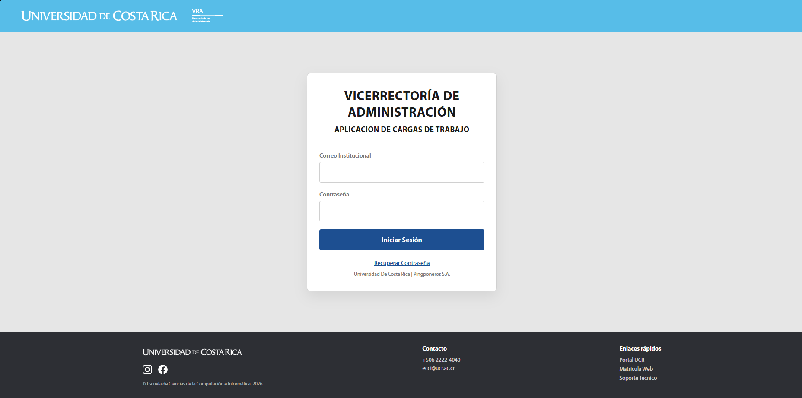
.png)
.png)

---

### ESC-02 — Recuperación de contraseña olvidada

| Campo | Detalle |
| --- | --- |
| **Objetivo** | Evaluar si el participante logra solicitar y completar el restablecimiento de su contraseña sin ayuda. |
| **Precondiciones** | El participante tiene acceso a la bandeja de su correo institucional. |
| **Pasos a seguir** | 1. Desde la pantalla de inicio de sesión, pulsar "¿Olvidó su contraseña?". 2. Ingresar el correo institucional y pulsar "Enviar enlace de recuperación". 3. Revisar el correo recibido y pulsar el enlace de recuperación. 4. Ingresar una nueva contraseña y su confirmación, observando el indicador de fortaleza. 5. Pulsar "Restablecer contraseña". 6. Iniciar sesión con la nueva contraseña. |
| **Resultado esperado** | El sistema muestra siempre el mismo mensaje de confirmación de envío (exista o no la cuenta), el correo llega en un tiempo razonable, el indicador de fortaleza guía al participante a cumplir los requisitos (mínimo 8 caracteres, una mayúscula, un número y un carácter especial) y el inicio de sesión con la nueva contraseña es exitoso. |
| **Observaciones** | No logró copiar la contraseña temporal a la primera. Esto principalmente porque tenía el correo en otra computadora y tuvo que ingresar manualmente la contraseña. Aparte de eso, sí completó la prueba correctamente. |

## Captura de Pantalla

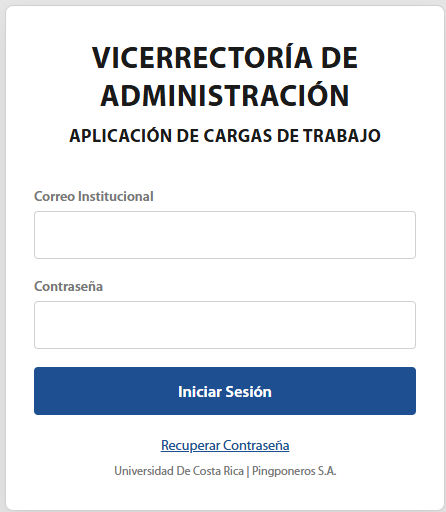

---

### ESC-03 — Cambio obligatorio de contraseña temporal

| Campo | Detalle |
| --- | --- |
| **Objetivo** | Verificar que un usuario con contraseña temporal comprenda que debe cambiarla antes de continuar y pueda hacerlo sin asistencia. |
| **Precondiciones** | El facilitador crea (o dispone de) un usuario con contraseña temporal recién asignada por un administrador. |
| **Pasos a seguir** | 1. Iniciar sesión con el correo y la contraseña temporal. 2. Observar la redirección automática a la pantalla de cambio de contraseña. 3. Ingresar la contraseña actual (temporal). 4. Ingresar y confirmar la nueva contraseña. 5. Pulsar "Cambiar contraseña". |
| **Resultado esperado** | El sistema impide el acceso a cualquier otra pantalla mientras la contraseña sea temporal, redirigiendo siempre a esta vista. Tras el cambio exitoso, el usuario puede navegar libremente al resto del sistema. |
| **Observaciones** | Sí pudo cambiar la contraseña correctamente. |

## Captura de Pantalla

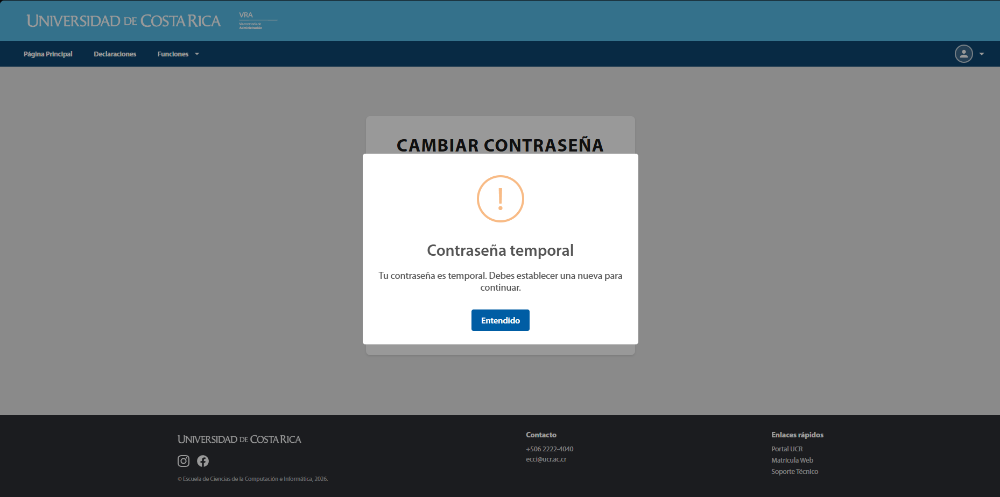
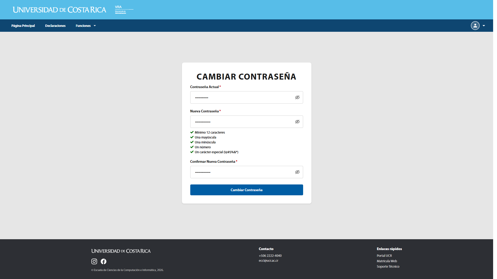
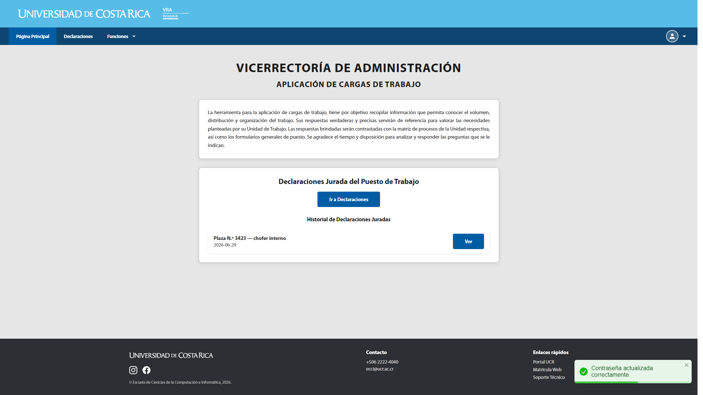

---

### ESC-04 — Navegación según el rol y acceso no autorizado

| Campo | Detalle |
| --- | --- |
| **Objetivo** | Verificar que el participante identifique correctamente las opciones de menú disponibles para su rol y observar qué ocurre si intenta acceder a una ruta restringida. |
| **Precondiciones** | Se dispone de una cuenta de Administrador y una de Funcionario. |
| **Pasos a seguir** | 1. Iniciar sesión como Funcionario y enumerar en voz alta las opciones visibles en el menú superior. 2. Cerrar sesión e iniciar sesión como Administrador; comparar las opciones disponibles. 3. Como Funcionario, intentar escribir manualmente en la barra de direcciones una ruta administrativa (por ejemplo, la de "Usuarios" o "Dashboard") y observar qué sucede. |
| **Resultado esperado** | El Funcionario ve únicamente "Página Principal", "Declaraciones" y "Funciones → Usuarios", además del menú de perfil (Perfil, Cambiar Contraseña, Cerrar Sesión). El Administrador ve además Dashboard, Usuarios, Plazas, Organización, Puestos de trabajo, Clases Ocupacionales, Funciones → Oficiales y Reportes. Al intentar acceder directamente a una ruta administrativa, el Funcionario es redirigido silenciosamente a la Página Principal, **sin un mensaje explícito de "acceso denegado"**. |
| **Observaciones** | El usuario notó la diferencia en opciones y la redirección silenciosa. |

## Captura de Pantalla

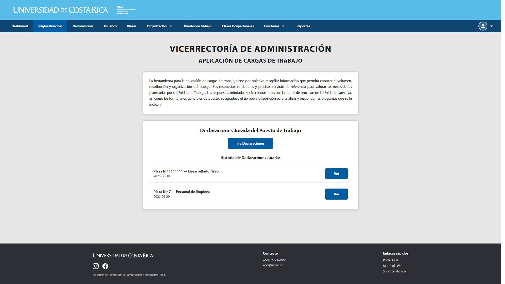

---

### ESC-05 — Registro de una Declaración Jurada de Carga de Trabajo

| Campo | Detalle |
| --- | --- |
| **Objetivo** | Determinar si el participante puede completar el formulario de declaración de tres pasos sin asistencia ni errores de interpretación. |
| **Precondiciones** | El usuario Funcionario tiene al menos una plaza asignada y no tiene una declaración activa en curso. |
| **Pasos a seguir** | 1. Desde la Página Principal, pulsar "Ir a Declaraciones". 2. Leer el aviso importante y pulsar "Iniciar Declaración". 3. **Paso 1 — Información General:** seleccionar el número de plaza, verificar que el cargo y la clase ocupacional se completan automáticamente, completar lugar de trabajo, jornada laboral, hora de entrada y hora de salida; pulsar "Siguiente". 4. **Paso 2 — Diagnóstico:** agregar al menos dos actividades mediante el botón correspondiente (eligiendo funciones oficiales o registrando una función propia), revisar el cálculo automático de la carga; pulsar "Siguiente". 5. **Paso 3 — Información Adicional:** completar el tiempo de descanso y, si aplica, declarar permisos/licencias y horas extra; pulsar "Finalizar Formulario". |
| **Resultado esperado** | El participante avanza por los tres pasos sin quedar atascado, entiende qué campos son de solo lectura (cargo, clase ocupacional) y cuáles debe completar, y al finalizar recibe confirmación de que el registro fue guardado y es redirigido a la Página Principal, donde la declaración aparece en su historial. |
| **Observaciones** | Se completó la prueba exitosamente. |

## Captura de Pantalla

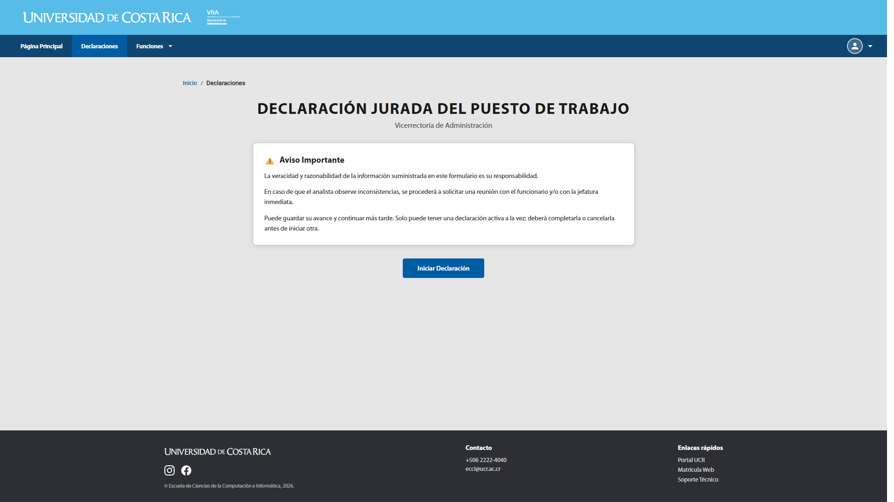

---

### ESC-06 — Consulta del historial y vista detallada de una declaración

| Campo | Detalle |
| --- | --- |
| **Objetivo** | Verificar que el participante pueda localizar una declaración ya guardada y revisar su contenido. |
| **Precondiciones** | El usuario cuenta con al menos una declaración completada (ESC-05 ejecutado previamente). |
| **Pasos a seguir** | 1. Desde la Página Principal, ubicar el historial de declaraciones juradas. 2. Pulsar "Ver" sobre el registro deseado. 3. Revisar la información mostrada (datos del puesto, horario, descanso, permisos, horas extra y actividades). 4. (Solo si aplica) Pulsar "Reporte de Horas" y luego "Imprimir Declaración" para generar los documentos PDF asociados. |
| **Resultado esperado** | El historial muestra el número de plaza, el cargo y la fecha de cada declaración. La vista de detalle reproduce fielmente los datos capturados en el formulario. Los botones de reporte generan/descargan los documentos sin errores visibles. |
| **Observaciones** | Se completó la prueba exitosamente. |

## Captura de Pantalla

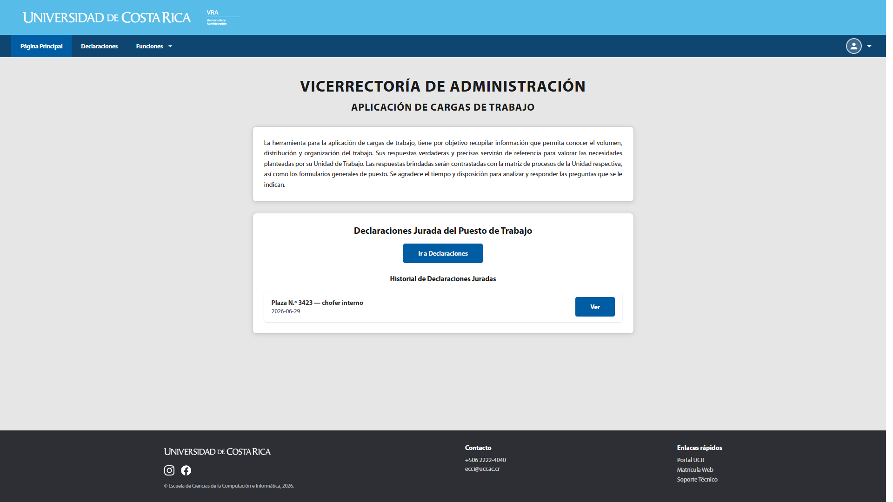

---

### ESC-07 — Cancelación de una declaración en progreso

| Campo | Detalle |
| --- | --- |
| **Objetivo** | Verificar que el participante entienda la consecuencia de cancelar una declaración antes de confirmarla. |
| **Precondiciones** | El usuario tiene una declaración activa (en borrador, sin finalizar). |
| **Pasos a seguir** | 1. Ingresar al formulario de la declaración activa (el sistema debe ofrecer "Continuar Declaración"). 2. Pulsar "Cancelar declaración". 3. Leer el mensaje de confirmación que aparece. 4. Confirmar la cancelación. |
| **Resultado esperado** | El sistema solicita confirmación antes de cancelar, y tras confirmar, elimina el borrador y permite iniciar una nueva declaración ("Iniciar Declaración" vuelve a estar disponible). |
| **Observaciones** | Si la canceló correctamente, el sistema eliminó el borrador y permitió iniciar una nueva declaración. Sugerencia: añadir un aviso de que existe una declaración existente. |

## Captura de Pantalla

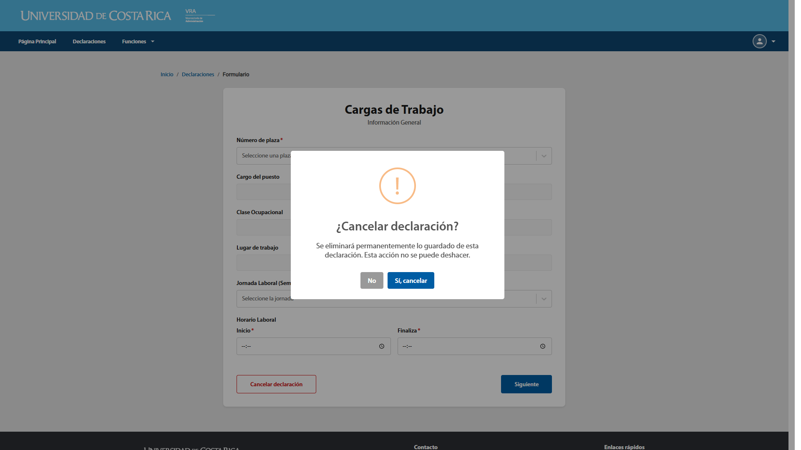

---

### ESC-08 — Consulta de "Mi Perfil" y cambio voluntario de contraseña

| Campo | Detalle |
| --- | --- |
| **Objetivo** | Verificar que el participante encuentre su información personal y pueda cambiar su contraseña sin estar obligado a ello. |
| **Precondiciones** | Sesión iniciada con cualquier rol. |
| **Pasos a seguir** | 1. Abrir el menú de perfil (esquina superior derecha) y pulsar "Perfil". 2. Revisar la información personal de solo lectura y la tabla de plazas asignadas. 3. Regresar al menú de perfil y pulsar "Cambiar Contraseña". 4. Ingresar la contraseña actual, la nueva contraseña y su confirmación. 5. Pulsar "Cambiar contraseña". |
| **Resultado esperado** | El participante ubica el menú de perfil sin instrucciones adicionales, comprende que los datos personales no son editables desde esa pantalla, y completa el cambio de contraseña recibiendo un mensaje de éxito o de error según corresponda. |
| **Observaciones** | Prueba completada exitosamente. |

## Captura de Pantalla

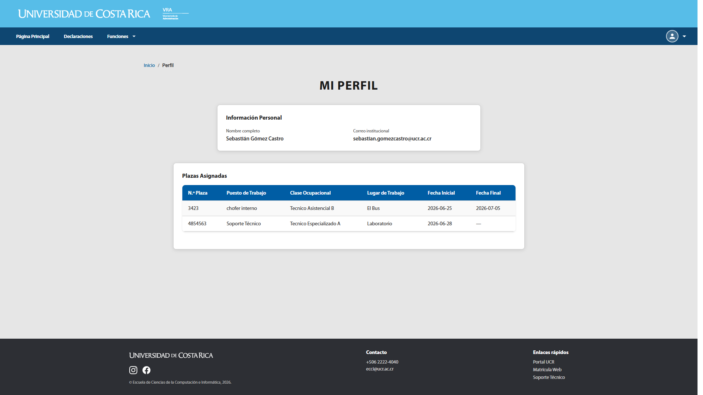
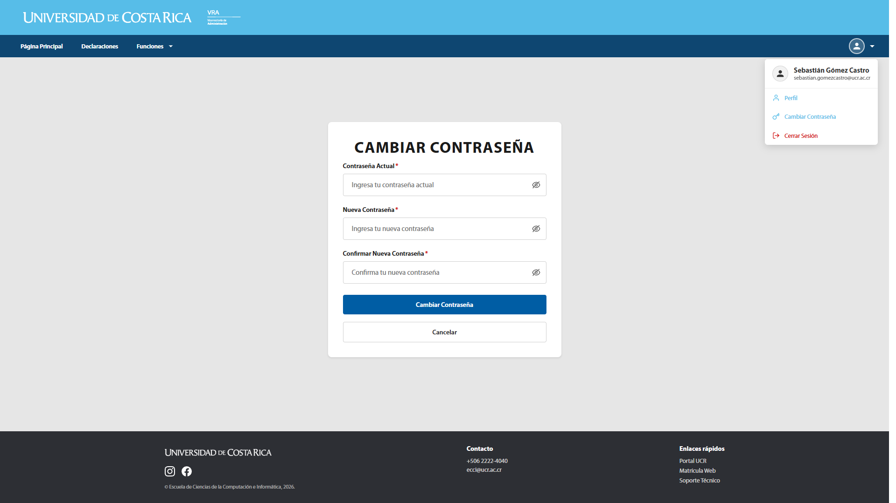

---

### ESC-09 — Gestión de Usuarios [Administrador]

| Campo | Detalle |
| --- | --- |
| **Objetivo** | Verificar que el administrador pueda crear un usuario y, posteriormente, editar su rol, su estado y las plazas que tiene asignadas. |
| **Precondiciones** | Sesión iniciada como Administrador; existe al menos una plaza disponible. |
| **Pasos a seguir** | 1. Ir a "Usuarios" en el menú. 2. Pulsar "Crear" y completar Primer Nombre, Segundo Nombre (opcional), Primer Apellido, Segundo Apellido, Correo Institucional, Rol y contraseña temporal; confirmar. 3. Buscar al usuario recién creado usando el campo de búsqueda. 4. Pulsar el ícono de editar (lápiz) sobre su fila. 5. Cambiar el campo "Rol" y el estado (Activo/Inactivo). 6. En la sección "Plazas asignadas" del mismo formulario, pulsar "Agregar plaza", seleccionar una plaza disponible, un puesto, una clase ocupacional, un lugar de trabajo y una fecha de inicio; confirmar. 7. Pulsar "Actualizar". 8. **(Prueba de expectativa)** Intentar localizar una opción para eliminar al usuario creado. |
| **Resultado esperado** | La creación, búsqueda, edición de rol/estado y la vinculación de una plaza se completan con mensajes de confirmación claros ("Usuario actualizado correctamente.", "Plaza vinculada correctamente."). En el paso 8, el participante **no debería encontrar** ninguna acción de eliminar, ya que esta pantalla no la ofrece; registrar si el participante la buscó y cuánto tiempo le tomó concluir que no existe. |
| **Observaciones** | Prueba completada exitosamente. Nada más que la hora del servidor causó confusión. |

## Captura de Pantalla

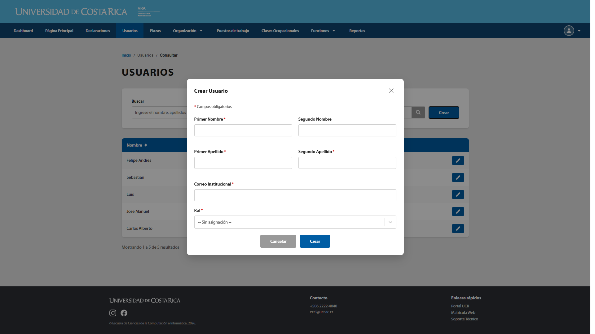

---

### ESC-10 — Gestión de Plazas [Administrador]

| Campo | Detalle |
| --- | --- |
| **Objetivo** | Verificar que el administrador pueda crear una plaza y modificar su ubicación organizacional. |
| **Precondiciones** | Sesión iniciada como Administrador; existen Áreas, Departamentos/Secciones y Unidades previamente registradas. |
| **Pasos a seguir** | 1. Ir a "Plazas". 2. Pulsar "Crear" e ingresar el número de plaza. 3. Seleccionar un Área. 4. Elegir el "Tipo de dependencia" (Departamento o Sección) y seleccionar la entidad correspondiente. 5. (Opcional) Seleccionar una Unidad. 6. Confirmar la creación. 7. Buscar la plaza creada y pulsar el ícono de editar. 8. Cambiar el Área y observar cómo se actualizan las opciones de Departamento/Sección/Unidad disponibles. 9. Confirmar la actualización. |
| **Resultado esperado** | El formulario impide seleccionar a la vez un Departamento y una Sección para la misma plaza, mostrando un mensaje de error claro si se intenta. Las opciones de Departamento, Sección y Unidad se filtran según el Área elegida. La creación y edición muestran mensajes de éxito ("Plaza creada correctamente.", "Plaza actualizada correctamente."). |
| **Observaciones** | Prueba completada exitosamente. Nada más que en un momento no cargaron los departamentos del área. |

## Captura de Pantalla

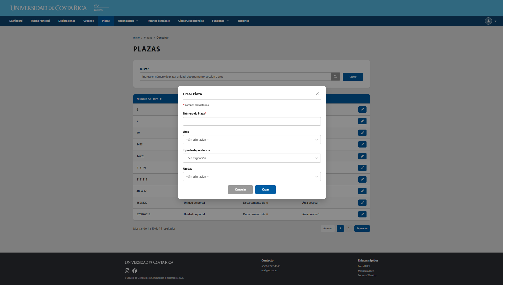

---

### ESC-11 — Gestión de la estructura organizacional (Áreas, Departamentos, Secciones, Unidades) [Administrador]

| Campo | Detalle |
| --- | --- |
| **Objetivo** | Verificar que el administrador pueda crear y editar registros en los cuatro niveles de la estructura organizacional, y que comprenda la relación jerárquica entre ellos. |
| **Precondiciones** | Sesión iniciada como Administrador. |
| **Pasos a seguir** | 1. Ir a "Organización → Áreas"; crear un Área con Nombre y Descripción. 2. Ir a "Organización → Departamentos"; crear un Departamento indicando Nombre, Descripción y el Área a la que pertenece. 3. Ir a "Organización → Secciones"; crear una Sección de forma equivalente. 4. Ir a "Organización → Unidades"; crear una Unidad indicando Nombre, Descripción, Área y un "Tipo de dependencia" (Departamento o Sección). 5. Editar (ícono de lápiz) uno de los cuatro registros creados y modificar su nombre o descripción. 6. Usar el campo de búsqueda de cada listado para localizar un registro por nombre. |
| **Resultado esperado** | El participante completa los cuatro formularios sin confundir los niveles jerárquicos, entiende que una Unidad depende de un Departamento **o** de una Sección (no ambos a la vez) y que el tipo de dependencia no puede cambiarse una vez creada la unidad si así lo indica la interfaz. La búsqueda filtra resultados por nombre, descripción y, según el listado, por Área. La edición confirma los cambios con un mensaje de éxito. |
| **Observaciones** | Prueba completada exitosamente. |

## Captura de Pantalla

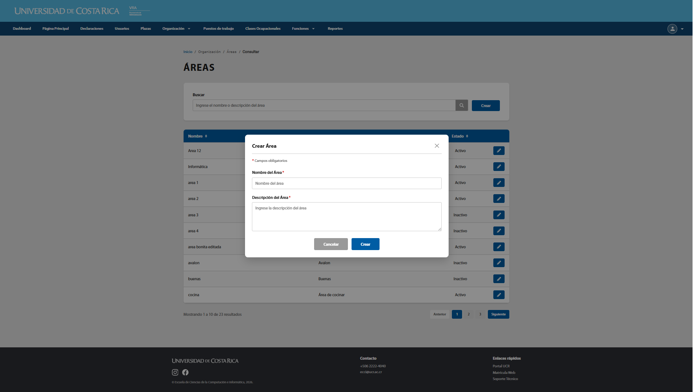
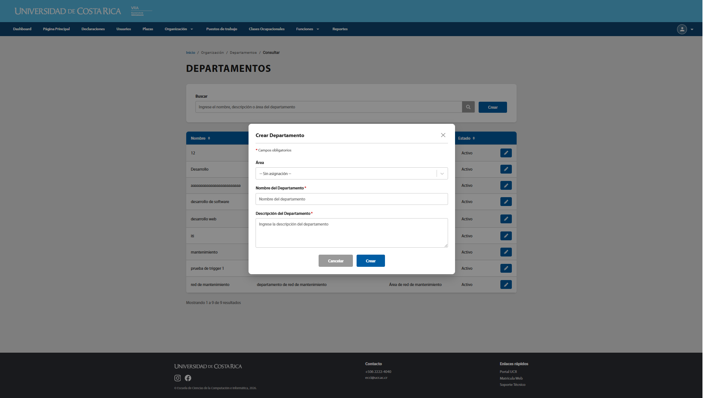
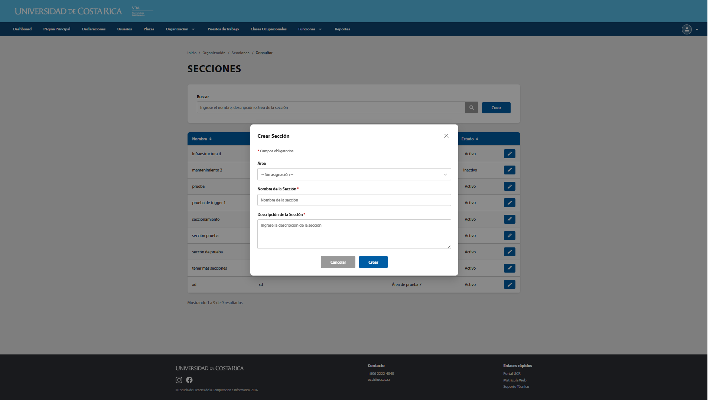
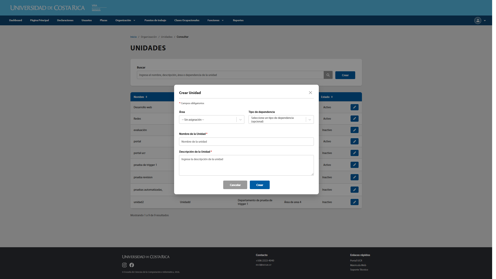

---

### ESC-12 — Gestión de Puestos de Trabajo y asignación de funciones [Administrador]

| Campo | Detalle |
| --- | --- |
| **Objetivo** | Verificar que el administrador pueda crear un puesto de trabajo, asociarle funciones del catálogo y eliminarlo cuando ya no se requiera. |
| **Precondiciones** | Sesión iniciada como Administrador; existe al menos una Función Oficial registrada. |
| **Pasos a seguir** | 1. Ir a "Puestos de trabajo" y pulsar "Crear", completando Nombre y Descripción del puesto. 2. Confirmar la creación. 3. Sobre la fila del puesto creado, pulsar la acción "Gestionar funciones". 4. Asociar una o más funciones oficiales al puesto desde el modal que se abre. 5. Retirar una de las funciones asociadas. 6. Pulsar el ícono de papelera sobre el puesto y confirmar su eliminación. |
| **Resultado esperado** | El participante localiza la acción "Gestionar funciones" (distinta del ícono de edición, que no existe para este listado) sin mayor dificultad. La asociación y desvinculación de funciones se reflejan de inmediato en el modal. La eliminación del puesto solicita confirmación explícita antes de ejecutarse. |
| **Observaciones** | Prueba completada exitosamente. |

## Captura de Pantalla

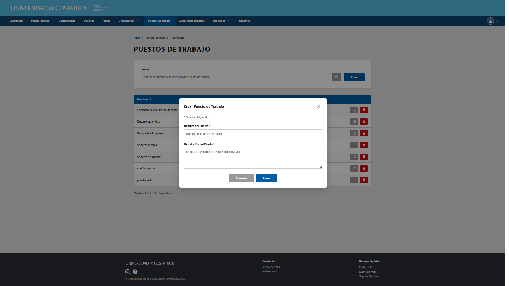

---

### ESC-13 — Gestión de Clases Ocupacionales y Funciones Oficiales [Administrador]

| Campo | Detalle |
| --- | --- |
| **Objetivo** | Verificar que el administrador pueda mantener los catálogos de Clases Ocupacionales y Funciones Oficiales, comprendiendo que no admiten edición posterior. |
| **Precondiciones** | Sesión iniciada como Administrador. |
| **Pasos a seguir** | 1. Ir a "Clases Ocupacionales"; pulsar "Crear" e ingresar Código y Nombre; confirmar. 2. Buscar la clase ocupacional creada. 3. **(Prueba de expectativa)** Intentar editarla. 4. Eliminarla mediante el ícono de papelera y confirmar. 5. Repetir un ciclo equivalente (crear, buscar, intentar editar, eliminar) en "Funciones → Oficiales", ingresando Nombre y Descripción. |
| **Resultado esperado** | Ambos catálogos permiten crear, buscar y eliminar (con confirmación), pero **no ofrecen una acción de edición**. Registrar si el participante busca activamente un ícono de lápiz y cómo reacciona al no encontrarlo. |
| **Observaciones** | Prueba completada exitosamente. |

## Captura de Pantalla

[Insertar captura aquí]

---

### ESC-14 — Gestión de Funciones de Usuario ("Mis Funciones") [Administrador y Funcionario]

| Campo | Detalle |
| --- | --- |
| **Objetivo** | Verificar que cualquier usuario, sin importar su rol, pueda registrar funciones propias para usarlas al declarar actividades que no figuran en el catálogo oficial. |
| **Precondiciones** | Sesión iniciada (cualquier rol). |
| **Pasos a seguir** | 1. Ir a "Funciones → Usuarios". 2. Pulsar "Crear" e ingresar el Nombre y la Descripción de la función. 3. Confirmar la creación. 4. Buscar la función creada en el listado. 5. Eliminarla mediante el ícono de papelera. |
| **Resultado esperado** | La opción es accesible tanto para Administrador como para Funcionario (a diferencia de la mayoría de catálogos, que son exclusivos de Administrador). Si la sesión es de Administrador, el listado muestra una columna adicional "Usuario" que identifica al dueño de cada función. La creación y eliminación se confirman con mensajes claros. |
| **Observaciones** | Prueba completada exitosamente. |

## Captura de Pantalla

[Insertar captura aquí]

---

### ESC-15 — Generación y descarga de Reportes administrativos [Administrador]

| Campo | Detalle |
| --- | --- |
| **Objetivo** | Verificar que el administrador pueda generar, previsualizar y descargar los reportes disponibles en el formato de su elección. |
| **Precondiciones** | Sesión iniciada como Administrador; existen datos suficientes (usuarios, plazas, declaraciones) para que los reportes no aparezcan vacíos. |
| **Pasos a seguir** | 1. Ir a "Reportes". 2. Seleccionar un "Tipo de reporte" (Funcionarios, Declaraciones juradas, u Horas / carga laboral). 3. Seleccionar el "Formato" (PDF o Excel). 4. Pulsar "Generar Reporte". 5. Revisar la vista previa en PDF que se despliega. 6. Descargar el archivo generado. 7. Repetir el proceso eligiendo el formato Excel. |
| **Resultado esperado** | La vista previa siempre se muestra en PDF (incluso si el formato final elegido es Excel), permitiendo desplazamiento y zoom. La descarga entrega el archivo en el formato seleccionado con el contenido correspondiente al tipo de reporte elegido. |
| **Observaciones** | Prueba completada exitosamente. |

## Captura de Pantalla

[Insertar captura aquí]

---

### ESC-16 — Consulta del Dashboard administrativo [Administrador]

| Campo | Detalle |
| --- | --- |
| **Objetivo** | Evaluar si el administrador comprende e interpreta correctamente los indicadores, gráficos y alertas del panel principal. |
| **Precondiciones** | Sesión iniciada como Administrador; existen datos históricos de usuarios, plazas y declaraciones. |
| **Pasos a seguir** | 1. Ir a "Dashboard". 2. Identificar los indicadores numéricos (usuarios registrados/activos, plazas registradas/asignadas/disponibles, declaraciones completadas/pendientes). 3. Revisar el panel de alertas (declaraciones en progreso, contraseñas próximas a expirar, usuarios inactivos, plazas sin asignar). 4. Interpretar los gráficos de distribución de plazas por área, usuarios por rol y estado de declaraciones juradas. 5. Revisar las tablas de "Últimas plazas asignadas" y "Declaraciones recientes". 6. Usar uno de los accesos rápidos para navegar a otro módulo. |
| **Resultado esperado** | El participante interpreta correctamente al menos los indicadores y alertas principales sin necesitar explicación adicional, y logra usar los accesos rápidos para llegar al módulo correspondiente. |
| **Observaciones** | Prueba completada exitosamente. |

## Captura de Pantalla

[Insertar captura aquí]

---

### ESC-17 — Cierre de sesión

| Campo | Detalle |
| --- | --- |
| **Objetivo** | Verificar que el participante pueda cerrar sesión de forma intencional y segura. |
| **Precondiciones** | Sesión iniciada (cualquier rol). |
| **Pasos a seguir** | 1. Abrir el menú de perfil. 2. Pulsar "Cerrar Sesión". |
| **Resultado esperado** | El sistema cierra la sesión inmediatamente, muestra una notificación de confirmación ("Sesión cerrada.") y redirige a la pantalla de inicio de sesión. |
| **Observaciones** | Prueba completada exitosamente. |

## Captura de Pantalla

[Insertar captura aquí]

---

## 7. Tareas que debe realizar el usuario

Estas son las instrucciones que el facilitador entrega **verbalmente o por escrito** al participante durante la sesión, redactadas en lenguaje natural (sin nombrar botones ni rutas), para no condicionar su comportamiento. Cada tarea corresponde a uno o más casos de la sección 6.

### Tareas para el perfil Funcionario

| N.° | Tarea propuesta al participante |
| --- | --- |
| 1 | "Inicie sesión en el sistema con las credenciales que se le entregaron." |
| 2 | "Imagine que olvidó su contraseña. Recupérela usando únicamente su correo institucional." |
| 3 | "Registre la declaración jurada de su carga de trabajo para el período actual, incluyendo al menos dos actividades." |
| 4 | "Busque en el sistema la última declaración que guardó y revise su contenido." |
| 5 | "Inicie una nueva declaración y, antes de terminarla, cancélela." |
| 6 | "Revise su información personal y las plazas que tiene asignadas." |
| 7 | "Cambie su contraseña sin haber olvidado la anterior." |
| 8 | "Agregue una función personalizada que no encuentre en el catálogo institucional." |
| 9 | "Cierre sesión cuando termine." |

### Tareas para el perfil Administrador

| N.° | Tarea propuesta al participante |
| --- | --- |
| 1 | "Inicie sesión con la cuenta de administrador que se le entregó." |
| 2 | "Revise los indicadores generales del sistema en la pantalla principal de administración." |
| 3 | "Cree un nuevo usuario funcionario y, luego, cambie su rol a administrador." |
| 4 | "Asigne una plaza disponible a ese usuario." |
| 5 | "Cree una nueva plaza dentro de un área, departamento y unidad existentes." |
| 6 | "Cree un área, un departamento que pertenezca a esa área, y una unidad que dependa de ese departamento." |
| 7 | "Cree un puesto de trabajo y asígnele al menos una función del catálogo oficial." |
| 8 | "Cree una clase ocupacional y, después, elimínela." |
| 9 | "Genere un reporte de declaraciones juradas en formato PDF y descárguelo." |
| 10 | "Intente encontrar una forma de eliminar el usuario que creó en la tarea 3." |
| 11 | "Cierre sesión cuando termine." |

---

## 8. Criterios de evaluación

| Criterio | Descripción | Forma de medición |
| --- | --- | --- |
| Tasa de éxito por tarea | Proporción de participantes que completan la tarea sin ayuda del facilitador | Éxito / Éxito con ayuda / Fallido, por tarea y por participante |
| Tiempo en tarea | Tiempo transcurrido desde que se entrega la instrucción hasta que el participante la da por completada | Minutos:segundos, cronometrados por el observador |
| Cantidad de errores | Número de acciones incorrectas o de clics en elementos que no correspondían a la tarea | Conteo manual por el observador |
| Nivel de ayuda requerido | Cantidad e intensidad de las intervenciones del facilitador | Ninguna / Pista verbal / Demostración |
| Facilidad percibida | Percepción subjetiva de dificultad de cada tarea | Escala Likert de 1 (muy difícil) a 5 (muy fácil), reportada por el participante al finalizar cada tarea |
| Satisfacción general | Percepción global del sistema al finalizar la sesión completa | Cuestionario breve de satisfacción (p. ej. System Usability Scale — SUS) |
| Claridad de mensajes | Si los mensajes de error, confirmación y validación fueron comprendidos sin relectura | Sí / No / Parcial, por mensaje observado |
| Hallazgos de expectativa no cumplida | Casos en los que el participante buscó una acción que el sistema no ofrece (p. ej. eliminar un usuario) | Registro cualitativo: qué buscó, dónde, y cuánto tiempo le tomó desistir |

**Umbral de aceptación sugerido:** se considera que una tarea tiene un problema de usabilidad relevante si más del 30 % de los participantes de su rol correspondiente requieren ayuda o no logran completarla.

---

## 9. Resultados esperados

| Módulo | Resultado esperado |
| --- | --- |
| Autenticación | Inicio de sesión, recuperación y cambio de contraseña completados sin asistencia por al menos el 90 % de los participantes |
| Navegación | Participantes identifican correctamente las opciones disponibles para su rol en menos de 30 segundos |
| Declaraciones | Flujo de tres pasos completado sin errores de validación bloqueantes ni necesidad de reiniciar el formulario |
| Mi Perfil | Participantes ubican su información y la opción de cambio de contraseña sin recorrer más de dos pantallas distintas |
| Gestión de Usuarios, Plazas y Organización | Creación y edición completadas sin asistencia; participantes comprenden, tras explorar, que estos listados no incluyen eliminación |
| Puestos de Trabajo, Clases Ocupacionales y Funciones Oficiales | Creación y eliminación completadas sin asistencia; participantes comprenden, tras explorar, que estos listados no incluyen edición |
| Funciones de Usuario | Funcionarios y administradores completan el ciclo crear/eliminar sin diferencias relevantes en tiempo o errores |
| Reportes | Generación, vista previa y descarga completadas en ambos formatos sin errores del navegador |
| Dashboard | Participantes interpretan correctamente al menos el 80 % de los indicadores mostrados sin pedir aclaración |
| Cierre de sesión | Acción completada en el primer intento por el 100 % de los participantes |

---

## 10. Observaciones

Espacio destinado al registro de notas cualitativas durante y después de cada sesión. Complete una tabla por participante.

**Participante N.°:** _____  **Rol evaluado:** _____  **Fecha:** _____  **Facilitador:** _____

| N.° de tarea / caso | Observación del facilitador | Comentario textual del participante |
| --- | --- | --- |
| | | |
| | | |
| | | |

**Incidencias técnicas detectadas durante la sesión** (errores del sistema, mensajes inesperados, bloqueos):

- _____

**Sugerencias espontáneas del participante:**

- _____

---

## 11. Conclusiones

Esta sección se completa **después** de ejecutar las sesiones con todos los participantes, consolidando los hallazgos individuales registrados en la sección 10 y los resultados cuantitativos de la sección 8.

**Guía para la redacción de las conclusiones:**

1. Resumir la tasa de éxito global por módulo, contrastándola con el resultado esperado de la sección 9.
2. Listar, en orden de severidad, los problemas de usabilidad identificados (por ejemplo: dificultad para encontrar una opción, mensajes de error ambiguos, expectativas no cumplidas como la ausencia de eliminación en ciertos catálogos).
3. Indicar si la asimetría de capacidades CRUD entre módulos (ver nota de la sección 5) representó una fuente real de confusión o si los participantes la asumieron sin inconvenientes.
4. Priorizar recomendaciones de mejora de interfaz, agrupadas en: cambios urgentes (bloquean tareas críticas), cambios recomendados (generan fricción pero no bloquean) y mejoras deseables (no afectan la tarea, mejoran la percepción).
5. Señalar diferencias relevantes de desempeño entre el perfil Administrador y el perfil Funcionario, si las hubiera.
6. Recomendar si se requiere una nueva ronda de pruebas tras aplicar los cambios sugeridos.

**Plantilla de cierre:**

> A partir de las `___` sesiones realizadas entre el `___` y el `___`, se concluye que el Proyecto de Cargas de Trabajo Administrativas `[cumple / cumple parcialmente / no cumple]` con los objetivos de usabilidad planteados en la sección 2. Los módulos con mejor desempeño fueron `___`, mientras que los módulos que requieren atención prioritaria son `___`. Se recomienda `___`.

---
